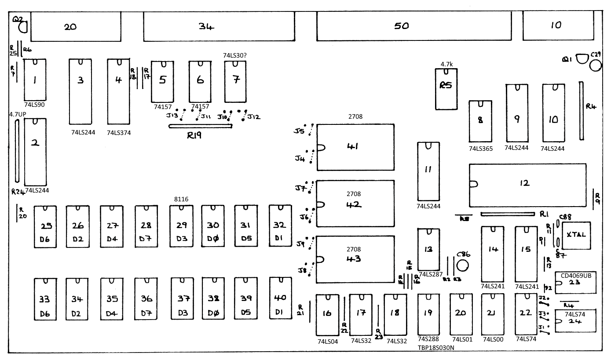
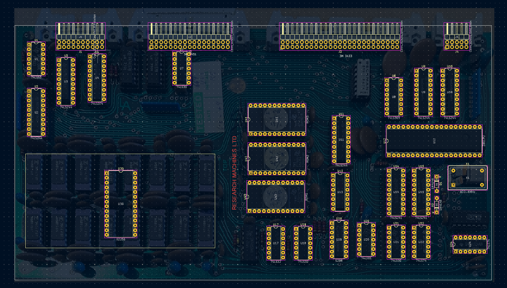

# Research Machines 380Z CPU Board

This is a modern replica of the 380Z CPU Board it's currently incomplete and I likely will never finish it. In the schematics I've replaced the original memory with a single chip to save on parts. I don't know how accurate it is but it should be pretty close.

